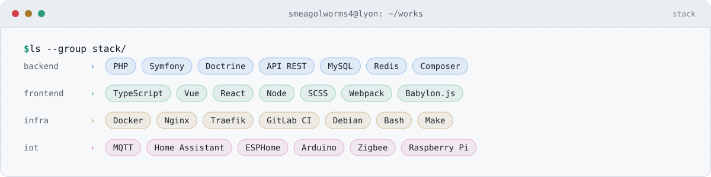
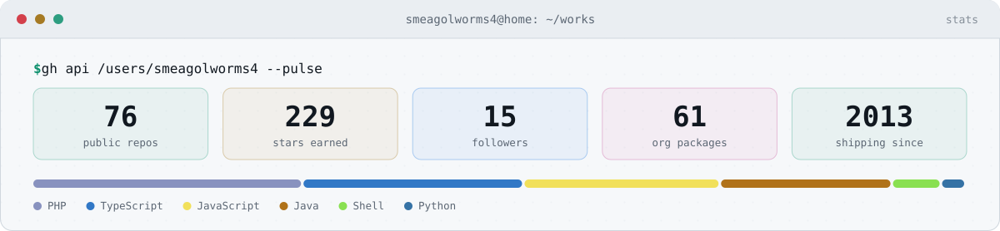

<!-- Les visuels sont générés par scripts/generate.mjs — modifier le script, pas les SVG. -->
<picture>
  <source media="(prefers-color-scheme: dark)" srcset="./assets/banner-dark.svg">
  <source media="(prefers-color-scheme: light)" srcset="./assets/banner-light.svg">
  
</picture>

<p align="center">
  <a href="https://github.com/Smeagolworms4?tab=followers"></a>
  <a href="https://github.com/GollumSF"></a>
  <a href="https://github.com/GollumJS"></a>
  <a href="https://github.com/GollumDom"></a>
  
</p>

<p align="center">
  <b>🇬🇧 <a href="./README.md">This page in English</a></b>
</p>

<p align="center">
  Je fabrique des briques petites, nettes et réutilisables : des bundles Symfony qui font une seule chose<br>
  correctement, des bibliothèques TypeScript qui ne gênent personne, et une maison qui parle MQTT.<br>
  Tout auto-hébergé, tout open source.
</p>

---

## `~/` Boîte à outils

<picture>
  <source media="(prefers-color-scheme: dark)" srcset="./assets/stack-dark.svg">
  <source media="(prefers-color-scheme: light)" srcset="./assets/stack-light.svg">
  
</picture>

---

## 🐘 Symfony &amp; PHP — [`GollumSF`](https://github.com/GollumSF)

> ~24 paquets Composer. Des bundles courts, pas un framework dans le framework.

<table>
  <tr>
    <td width="50%" valign="top">
      <h3><a href="https://github.com/GollumSF/rest-bundle">rest-bundle</a> <a href="https://github.com/GollumSF/rest-bundle/stargazers"></a></h3>
      Une couche REST volontairement minimale pour Symfony : désérialisation de la requête, validation et réponses JSON, sans embarquer toute une plateforme d'API.<br><br>
      <code>PHP</code> <code>Symfony</code> <code>REST</code>
    </td>
    <td width="50%" valign="top">
      <h3><a href="https://github.com/GollumSF/rest-doc-bundle">rest-doc-bundle</a> <a href="https://github.com/GollumSF/rest-doc-bundle/stargazers"></a></h3>
      Le pendant du précédent : génère la documentation de l'API directement depuis les contrôleurs annotés pour <code>rest-bundle</code>. Aucune spec dupliquée.<br><br>
      <code>PHP</code> <code>OpenAPI</code> <code>documentation</code>
    </td>
  </tr>
  <tr>
    <td width="50%" valign="top">
      <h3><a href="https://github.com/GollumSF/doctrine-tinyint">doctrine-tinyint</a> <a href="https://github.com/GollumSF/doctrine-tinyint/stargazers"></a></h3>
      Le plus installé du lot. Ajoute le type Doctrine <code>TINYINT</code> qui manquait, pour que les petits entiers cessent de coûter quatre octets pièce.<br><br>
      <code>Doctrine</code> <code>DBAL</code> <code>MySQL</code>
    </td>
    <td width="50%" valign="top">
      <h3><a href="https://github.com/GollumSF/mjml-binary">mjml-binary</a> <a href="https://github.com/GollumSF/mjml-binary/stargazers"></a></h3>
      MJML livré en binaire compilé via Composer — des e-mails responsives sur un serveur PHP sans la moindre installation de Node.js à proximité.<br><br>
      <code>MJML</code> <code>e-mail</code> <code>sans Node</code>
    </td>
  </tr>
  <tr>
    <td width="50%" valign="top">
      <h3><a href="https://github.com/GollumSF/serializer-describe-annotation-bundle">serializer-describe-*-bundle</a> <a href="https://github.com/GollumSF/serializer-describe-annotation-bundle/stargazers"></a></h3>
      Déclarer les groupes de sérialisation là où ils ont leur place — sur l'entité — en version annotation ou attribut PHP&nbsp;8.<br><br>
      <code>Serializer</code> <code>attributs</code>
    </td>
    <td width="50%" valign="top">
      <h3><a href="https://github.com/GollumSF/entity-relation-setter">entity-relation-setter</a> <a href="https://github.com/GollumSF/entity-relation-setter/stargazers"></a></h3>
      Maintient automatiquement les deux côtés d'une association Doctrine, pour ne plus réécrire les mêmes <code>addX()/removeX()</code>.<br><br>
      <code>Doctrine</code> <code>ORM</code>
    </td>
  </tr>
</table>

<details>
<summary><b>Le reste de la caisse à outils</b> — 18 paquets de plus</summary>
<br>

| Paquet | Rôle |
| --- | --- |
| [`enum`](https://github.com/GollumSF/enum) | Implémentation d'enum pour les versions de PHP qui n'en avaient pas |
| [`uuid`](https://github.com/GollumSF/uuid) · [`doctrine-enum`](https://github.com/GollumSF/doctrine-enum) · [`doctrine-type`](https://github.com/GollumSF/doctrine-type) | Types Doctrine supplémentaires |
| [`doctrine-arraypipe`](https://github.com/GollumSF/doctrine-arraypipe) | Manipulation des résultats Doctrine en pipeline |
| [`libsass-bundle`](https://github.com/GollumSF/libsass-bundle) | Filtre libsass pour Assetic |
| [`url-tokenizer-bundle`](https://github.com/GollumSF/url-tokenizer-bundle) | URLs signées et expirantes |
| [`controller-action-extractor-bundle`](https://github.com/GollumSF/controller-action-extractor-bundle) | Retrouve la classe et l'action depuis une Request ou une Route |
| [`reflection-property-test`](https://github.com/GollumSF/reflection-property-test) | Helpers de réflexion pour les tests unitaires |
| [`email-bundle`](https://github.com/GollumSF/email-bundle) · [`cache-bundle`](https://github.com/GollumSF/cache-bundle) · [`core-bundle`](https://github.com/GollumSF/core-bundle) · [`user-bundle`](https://github.com/GollumSF/user-bundle) | La plomberie applicative |
| [`manager`](https://github.com/GollumSF/manager) · [`auth-rest-bundle`](https://github.com/GollumSF/auth-rest-bundle) | Gestionnaires de services et authentification REST |

</details>

---

## 🔷 TypeScript &amp; JavaScript — [`GollumJS`](https://github.com/GollumJS)

> Décorateurs, injection de dépendances et petits utilitaires — les morceaux que je réécrivais à chaque projet, jusqu'à les empaqueter.

<table>
  <tr>
    <td width="50%" valign="top">
      <h3><a href="https://github.com/GollumJS/GollumTS-Annotation">GollumTS-Annotation</a> <a href="https://github.com/GollumJS/GollumTS-Annotation/stargazers"></a></h3>
      Des annotations persistantes et lisibles sur les classes TypeScript — des métadonnées qui survivent à la compilation et s'interrogent à l'exécution.<br><br>
      <code>TypeScript</code> <code>décorateurs</code> <code>métadonnées</code>
    </td>
    <td width="50%" valign="top">
      <h3><a href="https://github.com/GollumJS/GollumTS-Service">GollumTS-Service</a> <a href="https://github.com/GollumJS/GollumTS-Service/stargazers"></a></h3>
      Un conteneur de services et un injecteur de dépendances pour TypeScript, construit sur la couche d'annotations ci-dessus. Les réflexes Symfony, dans le navigateur.<br><br>
      <code>DI</code> <code>conteneur</code> <code>TypeScript</code>
    </td>
  </tr>
  <tr>
    <td width="50%" valign="top">
      <h3><a href="https://github.com/GollumJS/vue-stored-prop-decorator">vue-stored-prop-decorator</a> <a href="https://github.com/GollumJS/vue-stored-prop-decorator/stargazers"></a></h3>
      <code>@Stored</code> transforme une portion du store Vuex en simple propriété typée, avec getter et setter générés.<br><br>
      <code>Vue</code> <code>Vuex</code> <code>décorateurs</code>
    </td>
    <td width="50%" valign="top">
      <h3><a href="https://github.com/GollumJS/vue-inout-prop-decorator">vue-inout-prop-decorator</a> <a href="https://github.com/GollumJS/vue-inout-prop-decorator/stargazers"></a></h3>
      De vraies props bidirectionnelles pour Vue : un <code>@InOut()</code> au lieu d'un couple prop + emit à chaque fois.<br><br>
      <code>Vue</code> <code>liaison bidirectionnelle</code>
    </td>
  </tr>
</table>

<details>
<summary><b>Également dans le tiroir</b></summary>
<br>

| Paquet | Rôle |
| --- | --- |
| [`gollumjs-log`](https://github.com/GollumJS/gollumjs-log) | Remplace `console.log` en conservant le vrai fichier et la vraie ligne |
| [`GollumTS-Trait`](https://github.com/GollumJS/GollumTS-Trait) | Des traits façon PHP en TypeScript |
| [`GollumTS-ObjectType`](https://github.com/GollumJS/GollumTS-ObjectType) · [`GollumTS-Time`](https://github.com/GollumJS/GollumTS-Time) | Dictionnaires typés et helpers de temps |
| [`proxy-array`](https://github.com/GollumJS/proxy-array) | Tableaux observables via `Proxy` |
| [`emit-decorator-circular-loader`](https://github.com/GollumJS/emit-decorator-circular-loader) | Démêle les imports circulaires de décorateurs |
| [`vue-babylonjs`](https://github.com/GollumJS/vue-babylonjs) | Un environnement 3D prêt à l'emploi pour Vue avec Babylon.js |
| [`design-system`](https://github.com/GollumJS/design-system) | Des jetons de design aux composants front prêts à poser |
| [`systemjs-require`](https://github.com/GollumJS/systemjs-require) | `require()` pour SystemJS |

</details>

---

## 🏠 Domotique &amp; IoT — [`GollumDom`](https://github.com/GollumDom)

> Une maison câblée en MQTT : tout appareil qui parle une API propriétaire finit avec sa passerelle, et toute passerelle finit en add-on Home Assistant.

<table>
  <tr>
    <td width="50%" valign="top">
      <h3>📦 <a href="https://github.com/GollumDom/addon-repository">addon-repository</a> <a href="https://github.com/GollumDom/addon-repository/stargazers"></a></h3>
      Mon dépôt d'add-ons Home Assistant — l'unique URL qui installe toutes les passerelles ci-dessous dans votre instance.<br><br>
      <code>Home Assistant</code> <code>add-ons</code> <code>Docker</code>
    </td>
    <td width="50%" valign="top">
      <h3>🔌 <a href="https://github.com/Smeagolworms4/MQTT-Explorer">MQTT-Explorer</a> <a href="https://github.com/Smeagolworms4/MQTT-Explorer/stargazers"></a></h3>
      Une compilation Node.js de MQTT Explorer, à lancer sur un serveur et à ouvrir dans le navigateur — sans installation de poste, accessible depuis tout le réseau.<br><br>
      <code>Node.js</code> <code>MQTT</code> <code>auto-hébergé</code>
    </td>
  </tr>
  <tr>
    <td width="50%" valign="top">
      <h3>🌉 La famille <code>*2mqtt</code></h3>
      Une passerelle par API propriétaire récalcitrante, toutes vers le même broker :<br><br>
      <a href="https://github.com/Smeagolworms4/omv2mqtt">omv2mqtt</a> — NAS OpenMediaVault<br>
      <a href="https://github.com/Smeagolworms4/aldes2mqtt">aldes2mqtt</a> — VMC et PAC Aldes<br>
      <a href="https://github.com/Smeagolworms4/synology_ds2mqtt">synology_ds2mqtt</a> — Synology DiskStation<br>
      <a href="https://github.com/Smeagolworms4/meteoagricole2mqtt">meteoagricole2mqtt</a> — données météo agricoles<br>
      <a href="https://github.com/GollumDom/enedisgateway2mqtt">enedisgateway2mqtt</a> — consommation Enedis
    </td>
    <td width="50%" valign="top">
      <h3>📡 Matériel &amp; intégrations</h3>
      <a href="https://github.com/GollumDom/IRRemoteWifi">IRRemoteWifi</a> — émetteur infrarouge Wi-Fi avec son interface d'admin<br>
      <a href="https://github.com/Smeagolworms4/ir_remote_electrolux">ir_remote_electrolux</a> — télécommande de hotte Electrolux rétro-conçue<br>
      <a href="https://github.com/GollumDom/tp-link-legacy-integration">tp-link-legacy-integration</a> — garde le matériel TP-Link ancien vivant dans HA<br>
      <a href="https://github.com/Smeagolworms4/ha_second_core">ha_second_core</a> — un second cœur Home Assistant, en parallèle<br>
      <a href="https://github.com/GollumDom/lovelace-script-mod">lovelace-script-mod</a> — des scripts personnalisés dans les cartes Lovelace
    </td>
  </tr>
</table>

---

## 🧰 Outils &amp; petits services

<table>
  <tr>
    <td width="33%" valign="top">
      <h4><a href="https://github.com/Smeagolworms4/image-resizer">image-resizer</a></h4>
      Redimensionnement et conversion d'images à la volée en HTTP, pensé pour se placer derrière un CDN ou un proxy de cache.
    </td>
    <td width="33%" valign="top">
      <h4><a href="https://github.com/Smeagolworms4/ip-info">ip-info</a></h4>
      Tout ce qu'une adresse IP peut révéler — pays, ville, coordonnées, fuseau, AS — servi localement depuis les bases MaxMind.
    </td>
    <td width="33%" valign="top">
      <h4><a href="https://github.com/Smeagolworms4/docker-osm-proxy">docker-osm-proxy</a></h4>
      Un proxy de tuiles OpenStreetMap minimaliste en conteneur, pour des cartes qui ne matraquent pas les serveurs publics.
    </td>
  </tr>
  <tr>
    <td width="33%" valign="top">
      <h4><a href="https://github.com/Smeagolworms4/auto-makefile">auto-makefile</a></h4>
      Un Makefile qui se documente et se découvre tout seul, pour que <code>make</code> reste la porte d'entrée de chaque projet.
    </td>
    <td width="33%" valign="top">
      <h4><a href="https://github.com/Smeagolworms4/pop3_to_smtp">pop3_to_smtp</a></h4>
      Vide une boîte POP3 et la réinjecte en SMTP — la colle des configurations mail que personne ne veut migrer.
    </td>
    <td width="33%" valign="top">
      <h4><a href="https://github.com/Smeagolworms4/jellyfin-webhook-betaseries">jellyfin-webhook-betaseries</a></h4>
      Marque les épisodes comme vus sur BetaSeries depuis un webhook Jellyfin, pour un suivi entièrement automatique.
    </td>
  </tr>
  <tr>
    <td width="33%" valign="top">
      <h4><a href="https://github.com/Smeagolworms4/claude-switch-account">claude-switch-account</a></h4>
      Bascule entre plusieurs comptes Claude sans se réauthentifier à chaque fois.
    </td>
    <td width="33%" valign="top">
      <h4><a href="https://github.com/Smeagolworms4/docker-certbot-ovh-cron">docker-certbot-ovh-cron</a></h4>
      Certbot avec le challenge DNS OVH, sur cron, en conteneur. Posé une fois, les renouvellements s'oublient.
    </td>
    <td width="33%" valign="top">
      <h4><a href="https://github.com/Smeagolworms4/gitlab-coverage">gitlab-coverage</a></h4>
      Badges et rapports de couverture pour les pipelines GitLab CI.
    </td>
  </tr>
</table>

---

## 📊 Pouls GitHub

<picture>
  <source media="(prefers-color-scheme: dark)" srcset="./assets/pulse-dark.svg">
  <source media="(prefers-color-scheme: light)" srcset="./assets/pulse-light.svg">
  
</picture>

<sub>Régénéré chaque jour depuis l'API publique GitHub par <a href="./scripts/generate.mjs"><code>scripts/generate.mjs</code></a>. Aucun nom de dépôt privé ni détail d'activité privée n'est exposé.</sub>

---

## ⛏️ Minecraft — les archives de 2013

> Là où tout a commencé. Java, Forge et Bukkit, gardés en ligne pour l'histoire plus que pour le code.

| Dépôt | À l'époque |
| --- | --- |
| [`Smeagol-s-Custom-Blocks`](https://github.com/Smeagolworms4/Smeagol-s-Custom-Blocks) | Un mod Forge pour créer blocs et objets personnalisés sans écrire de Java |
| [`Smeagol-s-Minecraft-Creator`](https://github.com/Smeagolworms4/Smeagol-s-Minecraft-Creator) | L'éditeur construit par-dessus |
| [`Minecraft-ID-Changer`](https://github.com/Smeagolworms4/Minecraft-ID-Changer) | Réattribue les ID de blocs sur une map existante — le remède aux conflits de mods de l'époque |
| [`Minecraft-ID-Dumper`](https://github.com/Smeagolworms4/Minecraft-ID-Dumper) | Extrait la table complète des ID blocs/objets d'une installation |
| [`Misa-MisaServerMod`](https://github.com/Smeagolworms4/Misa-MisaServerMod) | Un mod serveur pour une communauté qui n'existe plus |

---

## `$ cat PRINCIPES`

```text
des paquets courts  ·  un rôle chacun  ·  auto-hébergé d'abord
open source par défaut  ·  documenter à la source  ·  rendre reproductible
tout appareil qui parle une API propriétaire finit avec sa passerelle
```

<p align="center">
  <a href="https://github.com/Smeagolworms4">GitHub</a> ·
  <a href="https://github.com/GollumSF">GollumSF</a> ·
  <a href="https://github.com/GollumJS">GollumJS</a> ·
  <a href="https://github.com/GollumDom">GollumDom</a> ·
  <a href="./README.md">English</a>
</p>

<picture>
  <source media="(prefers-color-scheme: dark)" srcset="./assets/footer-dark.svg">
  <source media="(prefers-color-scheme: light)" srcset="./assets/footer-light.svg">
  
</picture>
